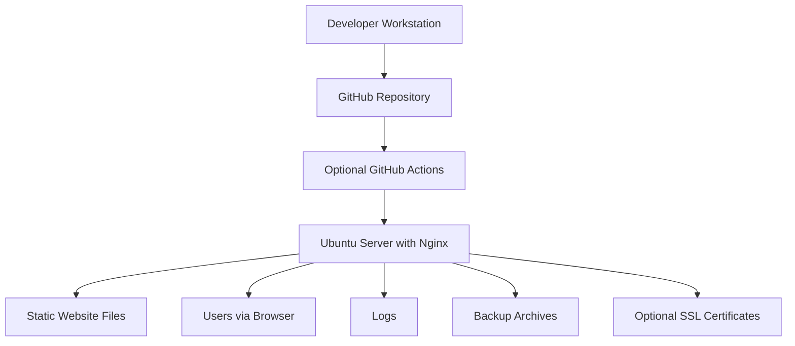

# Architecture

## Overview

This repository contains a static web project: a one-page landing website for the bachelor thesis project `Information System for Dental Clinic Management`.

The deployment model is intentionally simple:

- developers edit static files locally;
- changes are stored in the GitHub repository;
- optional CI validates and packages the site;
- production hosting is handled by Nginx on Ubuntu Server;
- users access the site through a browser over HTTP or HTTPS.

## Architecture Diagram

## Structural Components

| Component | Purpose |
|---|---|
| Developer workstation | Editing HTML, CSS, JS, images, and Markdown documentation |
| GitHub repository | Version control, collaboration, and source of truth |
| Optional CI/CD | Validation, artifact packaging, and optional GitHub Pages deployment |
| Ubuntu production server | Operating system for hosting the static site |
| Nginx web server | Serves static files to end users |
| Static files | `index.html`, stylesheets, scripts, images, manifest, robots, sitemap |
| Generated code docs | `generated-docs/reference/` HTML reference output generated from JSDoc comments |
| Logs | Nginx access and error logs used for diagnostics |
| Backups | Archived copies of site files, Nginx config, logs, and optional SSL material |

## Component Notes

### Developer Workstation

Typical tools:

- Git
- code editor
- browser
- optional Python 3 or Node.js for local preview

### GitHub Repository

Stores:

- source code of the landing page;
- operational documentation;
- helper scripts;
- optional infrastructure files such as container and CI definitions.

### Optional GitHub Actions

CI is optional for this project. If enabled, it can:

- verify that the main HTML entry point exists;
- check that required static files are present;
- package the site as a deployment artifact;
- optionally publish the site to GitHub Pages.

### Nginx Production Server

Nginx is the only required server-side runtime component. It serves the prepared static files from a directory such as `/var/www/histesting`.

### Static Files

The deployable application consists only of static content, for example:

- `index.html`
- `css/`
- `js/`
- `images/`
- `robots.txt`
- `sitemap.xml`
- `site.webmanifest`

### Frontend Behavior Layer

The landing page also includes a small documented browser behavior layer in `js/main.js`.

It enhances the static markup with:

- smooth in-page scrolling for navigation links;
- keyboard navigation to the main content area;
- lazy loading for deferred images;
- navigation active-state tracking based on scroll position;
- focus-state helpers for future forms.

The JavaScript code is documented with JSDoc and exposed through a small public browser interface, `window.LandingPageApp`, to keep behavior explicit and maintainable.

### Logs

Typical locations on Ubuntu:

- `/var/log/nginx/access.log`
- `/var/log/nginx/error.log`

### Backups

Typical backup targets:

- deployed site files;
- Nginx virtual host configuration;
- optional TLS certificates;
- relevant log files.

## What Is Not Used

The following infrastructure elements are not required for this repository:

- Application server: not used, because the project does not execute backend business logic on the server.
- Database: not used, because the landing page stores no application data.
- Cache service: not used, because Nginx can serve the static files directly.
- Dedicated file storage service: not used, because all required content is part of the static project files.
- Background workers or schedulers: not used, because there are no asynchronous processing tasks in this site.

## Data Flow Summary

1. A developer updates the static files locally.
2. JSDoc can generate HTML reference documentation from `js/main.js`.
3. The changes are committed and pushed to GitHub.
4. Optional CI validates the repository, including code-quality and documentation checks, and prepares an artifact.
5. The static files are deployed to the Ubuntu server.
6. Nginx serves the files directly to users.
7. Logs and backups support troubleshooting and recovery.
