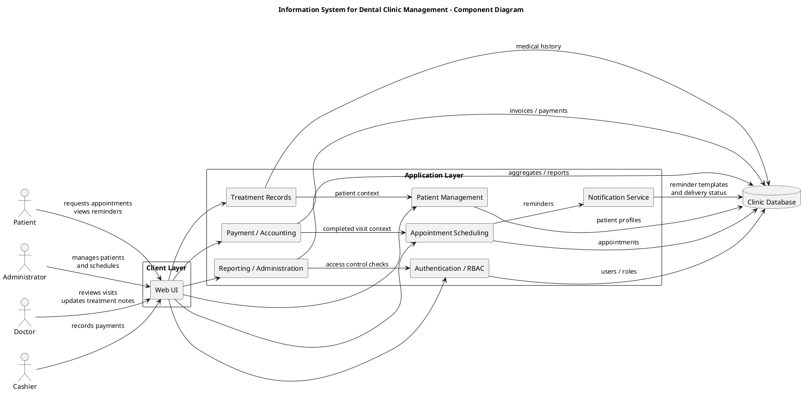
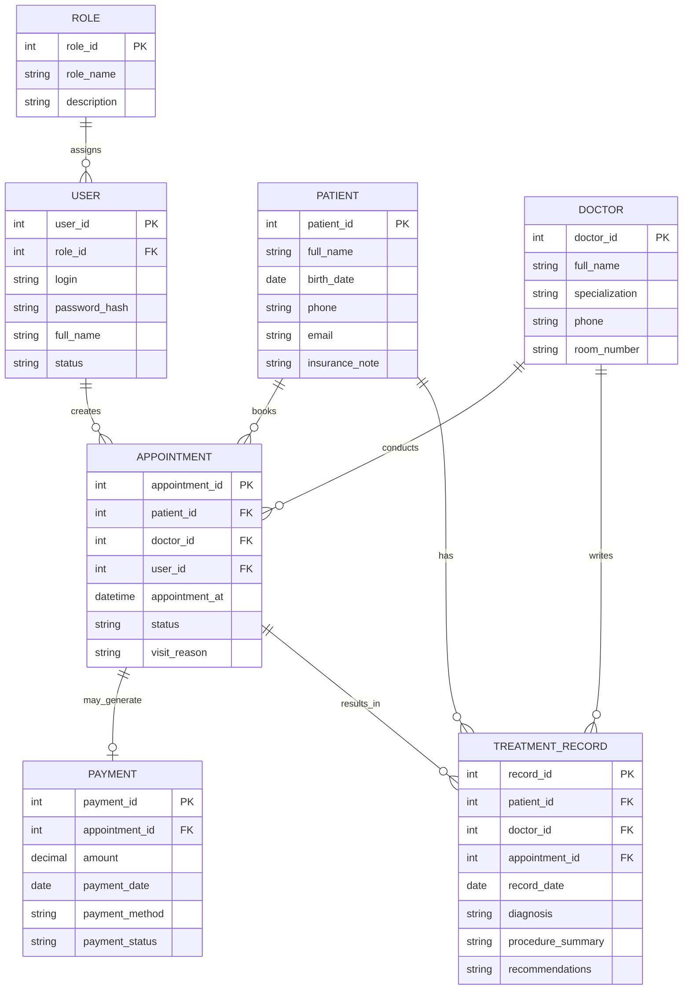

# Лабораторна робота: аналіз та побудова діаграм для бакалаврського проєкту

## 1. Тема бакалаврської роботи та основні результати

**Тема:** «Інформаційна система для управління стоматологічною клінікою».

Мета бакалаврського проєкту полягає у проєктуванні веб-орієнтованої інформаційної системи, яка підтримує типові процеси стоматологічної клініки:

- ведення карток пацієнтів;
- планування та супровід записів на прийом;
- підтримку робочого процесу лікаря;
- облік оплат і фінансових операцій;
- рольовий доступ до функцій системи;
- адміністративне управління та звітність.

Очікувані результати проєкту:

- структурований опис модулів інформаційної системи;
- формалізація ключового бізнес-процесу запису пацієнта та проведення візиту;
- визначення основних сутностей предметної області й зв’язків між ними;
- підготовка набору діаграм, придатних для пояснення архітектури, процесів і даних у межах бакалаврської роботи.

У цій лабораторній роботі розглянуто **3 категорії діаграм**:

1. структурні діаграми;
2. діаграми моделювання бізнес-процесів;
3. діаграми даних.

Для кожної категорії розглянуто **рівно 3 альтернативи**, а також обрано **по 1 діаграмі для практичної реалізації**.

## 2. Теоретичний аналіз категорій діаграм

## 2.1. Категорія 1: структурні діаграми

Для цієї категорії обрано такі альтернативи:

1. діаграма компонентів;
2. діаграма розгортання;
3. діаграма класів.

### 2.1.1. Діаграма компонентів

**Короткий опис.** Діаграма компонентів UML належить до структурних діаграм і відображає великі програмні частини системи, їх інтерфейси та залежності між ними [1], [2].

**Що показує.** Вона показує модулі системи, сервіси, підсистеми, зовнішні залежності та зв’язки використання між ними.

**Де корисна для цього проєкту.** Для стоматологічної інформаційної системи така діаграма зручна для відображення взаємодії між `Web UI`, модулем автентифікації, підсистемою роботи з пацієнтами, планувальником записів, модулем оплат, адмініструванням та базою даних.

**Переваги.**

- добре показує модульну архітектуру системи;
- підходить для пояснення меж відповідальності підсистем;
- корисна для захисту бакалаврської роботи, коли треба швидко пояснити склад системи;
- добре узгоджується з веб-орієнтованим характером проєкту.

**Недоліки.**

- не показує фізичне середовище розміщення компонентів;
- не деталізує структуру класів або таблиць;
- не описує покрокову бізнес-логіку процесів.

### 2.1.2. Діаграма розгортання

**Короткий опис.** Діаграма розгортання UML відображає, як програмні артефакти розміщуються на вузлах інфраструктури: серверах, пристроях, базах даних, мережевих вузлах [1], [3].

**Що показує.** Вона показує апаратні або віртуальні вузли, середовище виконання, сховища та розміщення компонентів на цих вузлах.

**Де корисна для цього проєкту.** Для бакалаврського проєкту вона була б корисною для пояснення розміщення вебзастосунку, бази даних, сервісу сповіщень та клієнтських робочих місць.

**Переваги.**

- демонструє фізичну архітектуру й середовище розгортання;
- корисна для опису продакшн- або тестового середовища;
- добре підходить для аналізу інфраструктурних ризиків.

**Недоліки.**

- менш зручна для пояснення функціональних модулів системи;
- у студентському проєкті може бути занадто інфраструктурно-орієнтованою;
- не фокусується на бізнес-функціях клініки.

### 2.1.3. Діаграма класів

**Короткий опис.** Діаграма класів UML описує статичну структуру системи через класи, атрибути, операції та відношення між ними [1], [4].

**Що показує.** Вона показує логічні сутності програмної моделі, спадкування, асоціації, композиції та залежності.

**Де корисна для цього проєкту.** Діаграма класів є доречною для деталізації доменних об’єктів на кшталт `Patient`, `Doctor`, `Appointment`, `Payment`, `User`, `Role`, `TreatmentRecord`.

**Переваги.**

- добре підтримує об’єктно-орієнтоване проєктування;
- корисна для деталізації внутрішньої моделі застосунку;
- дозволяє показати зв’язки між бізнес-сутностями на рівні коду.

**Недоліки.**

- у бакалаврському звіті може дублювати зміст ER-діаграми;
- важче читається для не технічної аудиторії;
- менш придатна для високорівневого пояснення всієї системи.

### 2.1.4. Порівняння альтернатив у категорії структурних діаграм

| Альтернатива | Основний фокус | Сильна сторона для теми клініки | Основне обмеження |
|---|---|---|---|
| Діаграма компонентів | Підсистеми та залежності | Найкраще пояснює модулі інформаційної системи | Не показує фізичне розгортання |
| Діаграма розгортання | Вузли та середовище виконання | Корисна для опису серверів і БД | Слабше показує бізнес-модулі |
| Діаграма класів | Логічна структура об’єктів | Добре деталізує доменну модель | Менш наочна як загальний архітектурний огляд |

### 2.1.5. Обґрунтування вибору для реалізації

Для практичної частини в цій категорії обрано **діаграму компонентів**.

**Чому саме вона.** Для теми стоматологічної клініки найважливіше показати, з яких модулів складається система та як вони взаємодіють між собою. Діаграма компонентів безпосередньо відповідає цій задачі.

**Чому не діаграма розгортання.** Вона корисна, але більше орієнтована на інфраструктуру, а не на функціональний склад системи.

**Чому не діаграма класів.** Вона потрібна для глибокого проєктування коду, але в цій лабораторній роботі структурний рівень доцільніше показати через модулі, а не через окремі класи.

## 2.2. Категорія 2: діаграми моделювання бізнес-процесів

Для цієї категорії обрано такі альтернативи:

1. BPMN;
2. DFD у нотації **Yourdon/DeMarco**;
3. IDEF0.

### 2.2.1. BPMN

**Короткий опис.** BPMN (Business Process Model and Notation) — стандартизована графічна нотація для опису бізнес-процесів і взаємодії учасників процесу [5].

**Що моделює.** BPMN моделює події, задачі, шлюзи, повідомлення, ролі та послідовність виконання процесу від початку до завершення.

**Де корисна для цього проєкту.** Для стоматологічної клініки BPMN особливо корисна при описі процесу запису на прийом, реєстрації пацієнта, консультації лікаря, фіксації медичного запису та проведення оплати.

**Переваги.**

- найкраще підходить для відображення послідовності бізнес-кроків;
- підтримує ролі та доріжки відповідальності;
- добре сприймається як технічними, так і організаційними учасниками;
- є стандартом, а не довільною локальною схемою.

**Недоліки.**

- повна нотація BPMN досить велика;
- для невеликого звіту надмірна деталізація може перевантажити схему;
- потребує акуратного вибору рівня деталізації.

### 2.2.2. DFD (нотація Yourdon/DeMarco)

**Короткий опис.** DFD у нотації Yourdon/DeMarco призначена для відображення потоків даних між процесами, сховищами та зовнішніми сутностями [6], [7].

**Що моделює.** Вона моделює потоки інформації, джерела та приймачі даних, а також процеси їх перетворення.

**Де корисна для цього проєкту.** Для інформаційної системи клініки DFD корисна при поясненні руху даних: від заявки пацієнта до картки пацієнта, журналу прийомів, платіжного запису та звітів.

**Переваги.**

- добре фокусується на потоках даних;
- придатна для аналізу інформаційних входів і виходів;
- проста для початкового системного аналізу.

**Недоліки.**

- слабко описує ролі учасників процесу;
- не призначена для відображення складної логіки прийняття рішень;
- менш виразна для операційного сценарію візиту пацієнта, ніж BPMN.

### 2.2.3. IDEF0

**Короткий опис.** IDEF0 — нотація функціонального моделювання, що описує функції системи через входи, керування, виходи та механізми (ICOM) [8].

**Що моделює.** Вона моделює функції системи та зв’язки між ними з погляду ресурсів, керувальних впливів і результатів.

**Де корисна для цього проєкту.** Для стоматологічної клініки IDEF0 може бути корисною для декомпозиції функцій «Керувати прийомами», «Вести медичні записи», «Обробляти оплату», «Формувати звіти».

**Переваги.**

- добре підходить для функціональної декомпозиції;
- дисциплінує аналітичний опис функцій;
- дає змогу відокремити керування, ресурси та результати.

**Недоліки.**

- менш інтуїтивна для відображення конкретного маршруту пацієнта;
- гірше показує послідовність подій у часі;
- рідше використовується у вебпроєктах, ніж BPMN.

### 2.2.4. Порівняння альтернатив у категорії бізнес-процесів

| Альтернатива | Основний фокус | Сильна сторона для теми клініки | Основне обмеження |
|---|---|---|---|
| BPMN | Послідовність процесу і ролі | Найкраще описує прийом пацієнта від запису до оплати | Потребує стриманої деталізації |
| DFD Yourdon/DeMarco | Потоки даних | Добре показує інформаційні потоки між підсистемами | Гірше показує ролі та часову послідовність |
| IDEF0 | Функції, входи, керування, механізми | Підходить для декомпозиції функцій клініки | Менш наочна для сценарію візиту |

### 2.2.5. Обґрунтування вибору для реалізації

Для практичної частини в цій категорії обрано **BPMN**.

**Чому саме вона.** Обраний для моделювання сценарій «Запис пацієнта на прийом та проведення візиту» є насамперед процесом із чіткими ролями та послідовністю дій. BPMN найкраще показує саме такий процес.

**Чому не DFD.** DFD краще підходить для опису потоків даних між процесами, але не так добре показує ролі пацієнта, адміністратора, лікаря та касира.

**Чому не IDEF0.** IDEF0 доречна для функціональної декомпозиції, але для конкретного сценарію візиту вона менш наочна, ніж BPMN.

## 2.3. Категорія 3: діаграми даних

Для цієї категорії обрано такі альтернативи:

1. ER-діаграма;
2. схема бази даних (schema diagram);
3. об’єктна діаграма.

### 2.3.1. ER-діаграма

**Короткий опис.** ER-діаграма відображає сутності предметної області, їх атрибути та зв’язки між сутностями [9].

**Що моделює.** Вона моделює логічну структуру даних, первинні сутності та кардинальності зв’язків.

**Де корисна для цього проєкту.** Для стоматологічної інформаційної системи ER-діаграма є природною для моделювання `Patient`, `Doctor`, `Appointment`, `Payment`, `TreatmentRecord`, `User`, `Role`.

**Переваги.**

- добре підходить для опису предметної області;
- наочно показує зв’язки типу «один-до-багатьох» і «один-до-одного»;
- корисна як проміжна ланка між аналізом предметної області та проєктуванням БД.

**Недоліки.**

- не показує повною мірою фізичні особливості реалізації БД;
- не відображає поведінку системи;
- при надлишковій деталізації може перетворюватися на майже табличну схему.

### 2.3.2. Схема бази даних (schema diagram)

**Короткий опис.** Схема бази даних відображає реляційні таблиці, стовпці, ключі, зовнішні ключі та інші елементи конкретної структури БД [10].

**Що моделює.** Вона моделює вже ближчу до реалізації структуру бази даних, включно з таблицями, обмеженнями та зв’язками.

**Де корисна для цього проєкту.** Така схема доречна на етапі фізичного проєктування БД для підготовки до реалізації сховища даних клініки.

**Переваги.**

- ближча до реального SQL-проєкту;
- добре підходить для реалізації та перевірки структури БД;
- дозволяє фіксувати таблиці, ключі та технічні атрибути.

**Недоліки.**

- менш зручна для початкового академічного пояснення предметної області;
- може перевантажувати деталями реалізації;
- слабше підходить для концептуального рівня опису.

### 2.3.3. Об’єктна діаграма

**Короткий опис.** Об’єктна діаграма UML відображає конкретні екземпляри об’єктів і зв’язки між ними в певний момент часу [1], [11].

**Що моделює.** Вона моделює знімок стану системи: конкретного пацієнта, конкретний прийом, конкретний платіж або інший набір взаємопов’язаних об’єктів.

**Де корисна для цього проєкту.** Для системи клініки об’єктна діаграма може бути корисною для демонстрації окремого сценарію, наприклад «пацієнт Іваненко має запис до лікаря Петренка на 10:00 і пов’язаний із конкретним платіжним записом».

**Переваги.**

- показує приклад конкретного стану системи;
- зручна для пояснення окремого кейсу;
- допомагає перевірити коректність моделі класів.

**Недоліки.**

- не є найкращим інструментом для опису повної моделі даних;
- погано масштабується для великої кількості сутностей;
- для цього бакалаврського проєкту менш корисна, ніж ER-діаграма.

### 2.3.4. Порівняння альтернатив у категорії діаграм даних

| Альтернатива | Основний фокус | Сильна сторона для теми клініки | Основне обмеження |
|---|---|---|---|
| ER-діаграма | Концептуальні сутності та зв’язки | Найкраще показує домен клініки на рівні сутностей | Не дає повної фізичної специфіки БД |
| Schema diagram | Таблиці, ключі, SQL-структура | Добре підходить для етапу реалізації БД | Менш зручна для концептуального пояснення |
| Object diagram | Конкретні екземпляри | Корисна для ілюстрації окремого кейсу | Не дає цілісної моделі даних системи |

### 2.3.5. Обґрунтування вибору для реалізації

Для практичної частини в цій категорії обрано **ER-діаграму**.

**Чому саме вона.** ER-діаграма найкраще балансує між концептуальною наочністю та достатньою деталізацією для бакалаврського проєкту. Вона прямо відповідає потребі показати основні сутності стоматологічної інформаційної системи та їх зв’язки.

**Чому не schema diagram.** Схема БД сильніше прив’язана до фізичної реалізації та SQL-рівня, що для цієї лабораторної роботи не є головною метою.

**Чому не object diagram.** Об’єктна діаграма корисна для одиничних прикладів, але не для цілісного опису предметної області.

## 3. Практична частина: реалізовані діаграми

## 3.1. Реалізована структурна діаграма: діаграма компонентів

**Файл джерела:** `docs/diagrams/component-diagram.puml`

Нижче подано вихідний код діаграми компонентів у форматі PlantUML.

**Зміст діаграми.**

- `Web UI` є єдиною клієнтською точкою входу для основних ролей системи.
- `Authentication / RBAC` відповідає за автентифікацію користувачів і перевірку ролей.
- `Patient Management` зберігає та надає дані про пацієнтів.
- `Appointment Scheduling` керує записами на прийом і взаємодіє з сервісом нагадувань.
- `Treatment Records` підтримує медичні записи та використовує контекст пацієнта.
- `Payment / Accounting` опрацьовує оплату після завершення прийому.
- `Reporting / Administration` формує управлінську та аналітичну інформацію.
- `Clinic Database` є центральним сховищем даних.

**Чому ця діаграма є реалістичною для теми.** Стоматологічна клініка працює через набір чітко відмежованих функціональних блоків: запис, картка пацієнта, лікування, оплата, доступ за ролями, адміністрування. Саме це і відображено на діаграмі.

## 3.2. Реалізована діаграма бізнес-процесу: BPMN-орієнтована схема

**Файл джерела:** `docs/diagrams/bpmn-visit-process.mmd`

Нижче подано **спрощене BPMN-орієнтоване представлення** у Mermaid. Воно не є повним BPMN 2.0 XML-поданням, але зберігає основну BPMN-ідею: ролі, послідовність дій, точки вибору та завершення процесу.

```mermaid
flowchart LR
    %% Simplified BPMN-oriented representation for the lab report.
    subgraph Patient["Пацієнт"]
        PStart([Початок])
        PRequest[Надсилає запит на запис]
        PConfirm[Підтверджує запропонований час]
        PVisit[Прибуває на прийом]
        PEnd([Візит завершено])
    end

    subgraph Administrator["Адміністратор"]
        ACheck[Перевіряє вільні слоти]
        ADecision{Є вільний час?}
        AOffer[Пропонує дату і час]
        ACreate[Створює запис на прийом]
        ARegister[Реєструє прибуття пацієнта]
    end

    subgraph Doctor["Лікар"]
        DConsult[Проводить консультацію\nта лікування]
        DRecord[Оновлює медичний запис]
    end

    subgraph Cashier["Каса / Оплата"]
        CInvoice[Формує суму до оплати]
        CPayment{Оплату проведено?}
        CReceive[Приймає оплату]
        CDebt[Фіксує відкладену оплату]
    end

    PStart --> PRequest --> ACheck --> ADecision
    ADecision -- Так --> AOffer --> PConfirm --> ACreate --> PVisit --> ARegister --> DConsult --> DRecord --> CInvoice --> CPayment
    ADecision -- Ні --> AOffer
    CPayment -- Так --> CReceive --> PEnd
    CPayment -- Ні --> CDebt --> PEnd
```

**Текстовий опис процесу.**

1. Пацієнт ініціює звернення щодо запису на прийом.
2. Адміністратор перевіряє доступні часові слоти.
3. Якщо вільний слот знайдено, пацієнту пропонується дата і час.
4. Після підтвердження адміністратор створює запис.
5. У день візиту адміністратор реєструє прибуття пацієнта.
6. Лікар проводить консультацію або лікування.
7. Після прийому лікар оновлює медичний запис пацієнта.
8. На касі формується сума до оплати.
9. Якщо оплата проведена, візит закривається як завершений.
10. Якщо оплата не проведена, система фіксує відкладену оплату, але візит усе одно завершується як відпрацьований клінічний випадок.

**Чому ця схема є доречною.** Вона відображає типовий маршрут пацієнта в стоматологічній клініці й розподіляє відповідальність між чотирма ролями: пацієнт, адміністратор, лікар, касир.

## 3.3. Реалізована діаграма даних: ER-діаграма

**Файл джерела:** `docs/diagrams/er-diagram.mmd`

**Текстовий опис ER-діаграми.**

- сутність `ROLE` задає ролі доступу в системі;
- сутність `USER` представляє обліковий запис працівника системи;
- `PATIENT` містить основні облікові та контактні дані пацієнта;
- `DOCTOR` описує лікаря та його спеціалізацію;
- `APPOINTMENT` фіксує сам факт запису на прийом, дату, статус, причину візиту та користувача, який створив запис;
- `TREATMENT_RECORD` містить медичний результат прийому: діагноз, процедури, рекомендації;
- `PAYMENT` зберігає фінансовий результат прийому.

**Основні зв’язки.**

- один пацієнт може мати багато записів на прийом;
- один лікар може проводити багато прийомів;
- один прийом може мати нуль або один платіжний запис;
- один пацієнт може мати багато медичних записів;
- один лікар може створювати багато медичних записів;
- кожен користувач належить до однієї ролі.

**Чому ця ER-модель реалістична.** Вона охоплює клінічний контур (`Patient`, `Doctor`, `TreatmentRecord`), операційний контур (`Appointment`) і адміністративно-фінансовий контур (`User`, `Role`, `Payment`), тобто ті частини, які прямо відповідають темі бакалаврського проєкту.

## 4. Загальний висновок за результатами порівняння

Для бакалаврського проєкту «Інформаційна система для управління стоматологічною клінікою» найбільш доречним виявився такий набір реалізованих діаграм:

- **діаграма компонентів** — для пояснення архітектурної структури системи;
- **BPMN** — для моделювання ключового операційного процесу клініки;
- **ER-діаграма** — для відображення сутностей та зв’язків предметної області.

Разом ці три діаграми утворюють логічно завершений комплект:

- структурний рівень;
- процесний рівень;
- рівень даних.

Саме така комбінація є найбільш придатною для академічного опису веб-орієнтованої інформаційної системи стоматологічної клініки.

## 5. Бібліографія

1. Object Management Group. UML - Unified Modeling Language [Електронний ресурс]. — Режим доступу: https://www.omg.org/uml/ (дата звернення: 28.03.2026).
2. Object Management Group. What is UML? [Електронний ресурс]. — Режим доступу: https://www.omg.org/uml/what-is-uml.htm (дата звернення: 28.03.2026).
3. PlantUML. Component Diagram syntax and features [Електронний ресурс]. — Режим доступу: https://plantuml.com/component-diagram (дата звернення: 28.03.2026).
4. PlantUML. Deployment Diagram syntax and features [Електронний ресурс]. — Режим доступу: https://plantuml.com/deployment-diagram (дата звернення: 28.03.2026).
5. PlantUML. Class Diagram syntax and features [Електронний ресурс]. — Режим доступу: https://plantuml.com/class-diagram (дата звернення: 28.03.2026).
6. Object Management Group. Business Process Modeling Notation (BPMN) Information. FAQ [Електронний ресурс]. — Режим доступу: https://www.omg.org/bpmn/Documents/FAQ.htm (дата звернення: 28.03.2026).
7. Visual Paradigm. What is Data Flow Diagram? [Електронний ресурс]. — Режим доступу: https://www.visual-paradigm.com/guide/data-flow-diagram/what-is-data-flow-diagram/ (дата звернення: 28.03.2026).
8. Visual Paradigm. Yourdon and DeMarco DFD Tool [Електронний ресурс]. — Режим доступу: https://www.visual-paradigm.com/features/yourdon-and-demarco-dfd-editor/ (дата звернення: 28.03.2026).
9. Vitech. IDEF0 Diagram [Електронний ресурс]. — Режим доступу: https://vitechcorp.com/resources/CORE/onlinehelp/desktop/Views/IDEF0.htm (дата звернення: 28.03.2026).
10. Oracle. Data Modeler Concepts and Usage [Електронний ресурс]. — Режим доступу: https://docs.oracle.com/en/database/oracle/sql-developer-data-modeler/19.1/dmdug/data-modeler-concepts-usage.html (дата звернення: 28.03.2026).
11. Mermaid. Entity Relationship Diagrams [Електронний ресурс]. — Режим доступу: https://mermaid.js.org/syntax/entityRelationshipDiagram.html (дата звернення: 28.03.2026).
12. IBM. Creating object model diagrams [Електронний ресурс]. — Режим доступу: https://www.ibm.com/docs/en/engineering-lifecycle-management-suite/design-rhapsody/10.0.2?topic=diagrams-creating-object-model (дата звернення: 28.03.2026).
